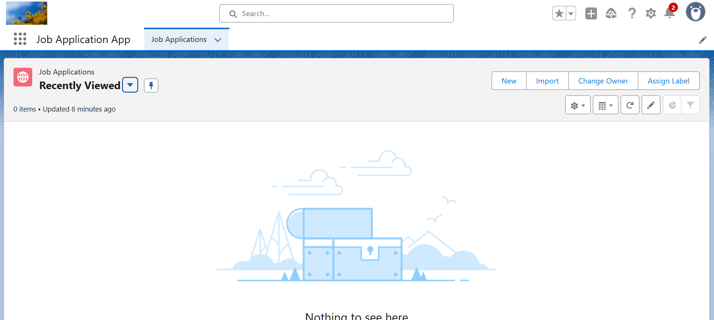
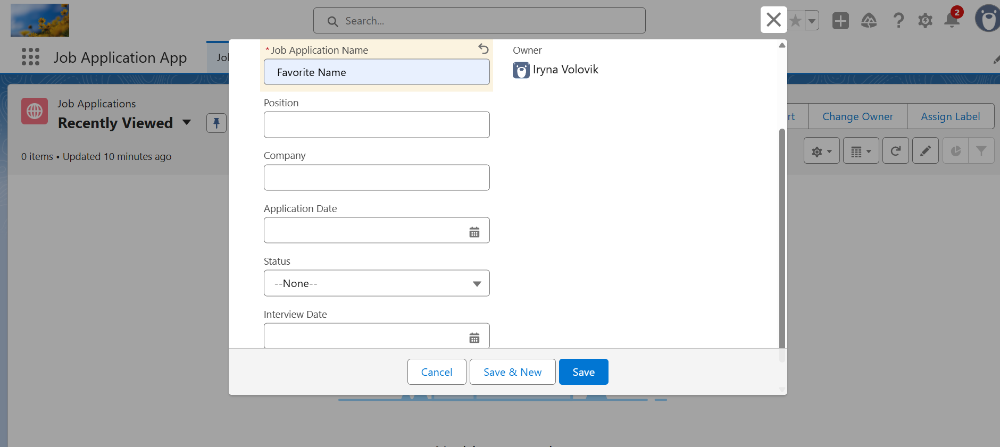
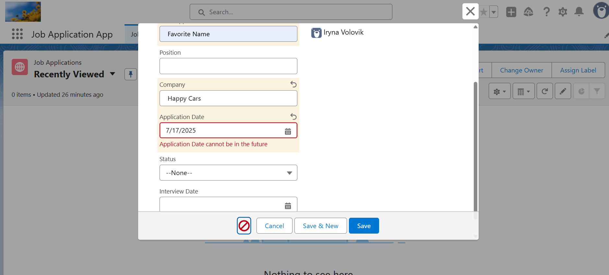
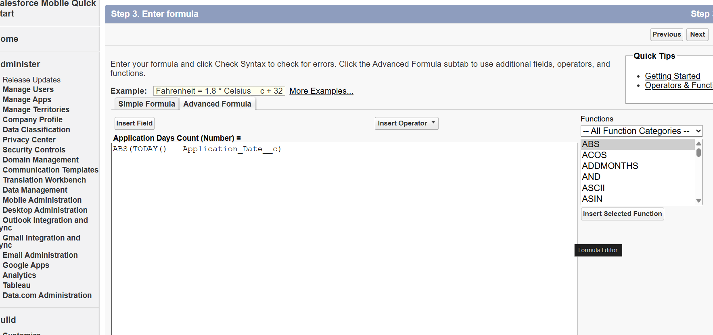

# 📝 Job Application Tracker (Salesforce Project)

This is my first hands-on **Salesforce project**, built as a self-learning aspiring Salesforce Developer!

---

## 📌 What I built:

I created a **custom object** to track job applications with fields like:

- Company
- Position
- Status
- Interview Date
- Application Date

I also implemented:

- ✅ **Validation Rules** (e.g. no future dates)
- ✅ **Formula Fields** (e.g. Days Since Application)
- ✅ **UI Layout Customization**

---

## 🧰 Tech Used:

- 🔹 Lightning App Builder
- 🔹 Custom Object & Fields
- 🔹 Validation Rules
- 🔹 Formula Fields

---

## 🔍 Screenshots

| App Page | New Record Form |
|---------|------------------|
|  |  |

| Validation Rule | Formula Field |
|------------------|---------------|
|  |  |

---

## 📚 Notes

More details are available in [`notes.md`](./notes.md)

---

## 🛤 Trailhead Progress

Currently working toward my **Salesforce Developer certification** and building projects to solidify my skills.  
Stay tuned for more projects! 🚀

---

**#Salesforce #SalesforceDeveloper #Trailblazer #WomenWhoCode**

